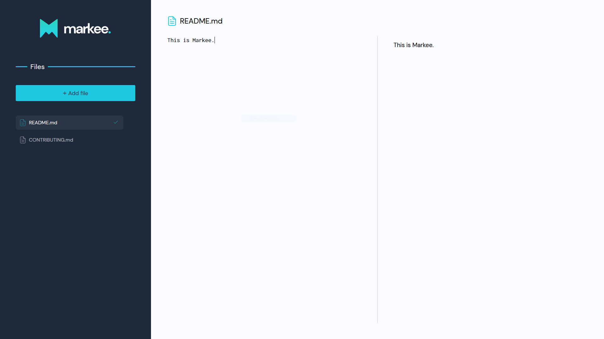

    

# Markee

    Markee is an app to write markdown files. It shows you a preview and automatically saves the files in the browser storage. It's open-source! Enjoy it!

 

## Get Started

    Access Markee <a href="https://markee-brenoh1ldebr4nd.vercel.app/">here</a>.

 

 
 

## Development

    This app was developed during the <a href="https://github.com/brainnco">Brainn Co.</a> bootcamp. It was created with React and Typescript. 

 

## License

    This app is under the <a href="./LICENSE">MIT License</a>.

